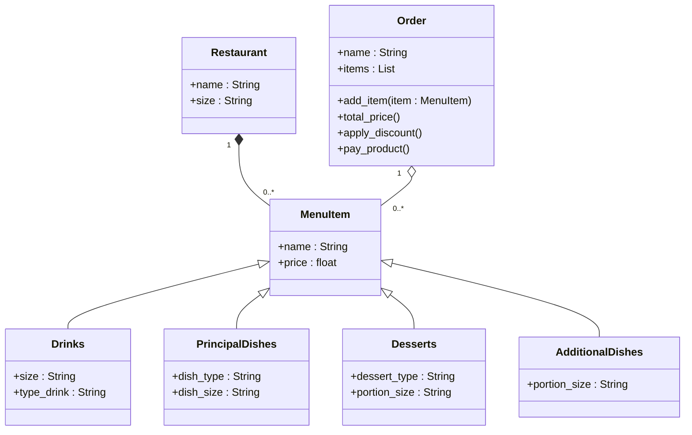

# Reto-3:Composición_vs_Herencia

1. Crear un repositorio con el ejercicio de clase

2. Escenario de restaurante: desea diseñar un programa para calcular la factura del pedido de un cliente en un restaurante.

- Definir una clase base MenuItem : Esta clase debe tener atributos como nombre, precio y un método para calcular el precio total.

- Cree subclases para diferentes tipos de elementos de menú: herede de MenuItem y defina propiedades específicas para cada tipo (por ejemplo, Bebida, Aperitivo, Plato principal).

- Definir una clase Order: Esta clase debe tener una lista de objetos MenuItem y métodos para agregar artículos, calcular el monto total de la factura y potencialmente aplicar descuentos específicos según la composición del pedido.

- Cree un diagrama de clases con todas las clases y sus relaciones. El menú debe tener al menos 10 elementos. El código debe seguir las reglas PEP8.

Hecho en mermaid


Hecho en python

```python

```