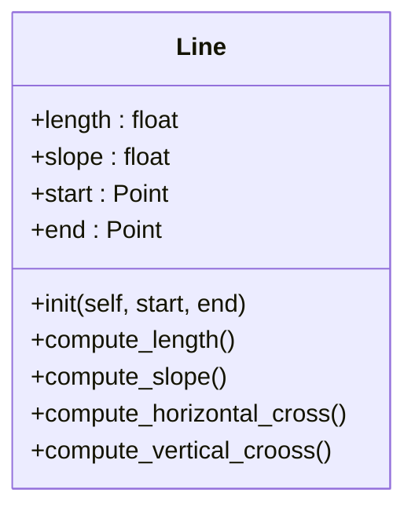
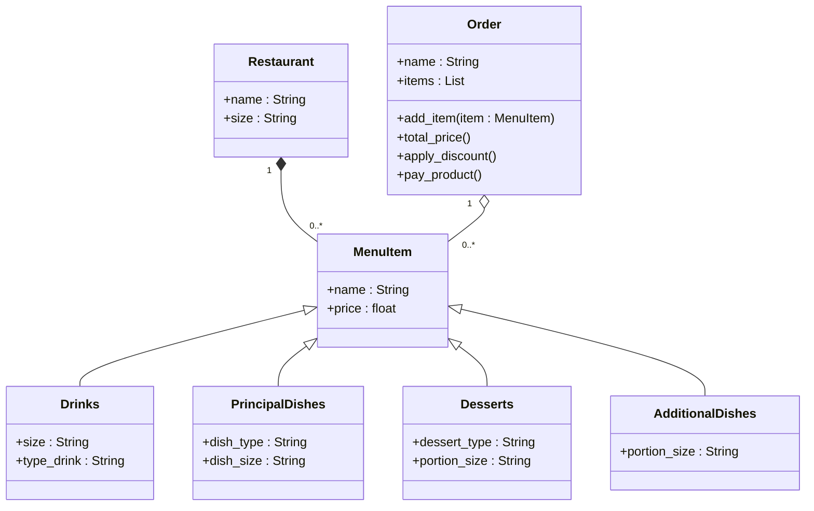

# Reto-3:Composición_vs_Herencia

# Ejercicio
- longitud , pendiente , inicio, fin: atributos de instancia, dos de ellos son puntos (por lo que una línea está compuesta al menos por dos puntos).

- compute_length(): debería devolver la longitud de la línea.

- compute_slope(): debe devolver la pendiente de la línea desde la horizontal en grados.

- compute_horizontal_cross(): debe devolver si existe la intersección con el eje x.

- compute_vertical_cross(): debe devolver si existe la intersección con el eje y.

2. Redefinir la clase Rectángulo, añadiendo un nuevo método de inicialización que utiliza 4 líneas (composición en su máxima expresión, un rectángulo se compone de 4 líneas).

3. Opcional: Defina un método llamado discretize_line() que cree una matriz con n puntos igualmente espaciados en la línea y la asigne como atributo de instancia.

Solucion Hecha en mermaid

[Solución_hecha_en_python](Line.py)

# Reto 3

1. Crear un repositorio con el ejercicio de clase

2. Escenario de restaurante: desea diseñar un programa para calcular la factura del pedido de un cliente en un restaurante.

- Definir una clase base MenuItem : Esta clase debe tener atributos como nombre, precio y un método para calcular el precio total.

- Cree subclases para diferentes tipos de elementos de menú: herede de MenuItem y defina propiedades específicas para cada tipo (por ejemplo, Bebida, Aperitivo, Plato principal).

- Definir una clase Order: Esta clase debe tener una lista de objetos MenuItem y métodos para agregar artículos, calcular el monto total de la factura y potencialmente aplicar descuentos específicos según la composición del pedido.

- Cree un diagrama de clases con todas las clases y sus relaciones. El menú debe tener al menos 10 elementos. El código debe seguir las reglas PEP8.

Hecho en mermaid del reto 3

[Solución_hecha_en_python](restaurante.py)